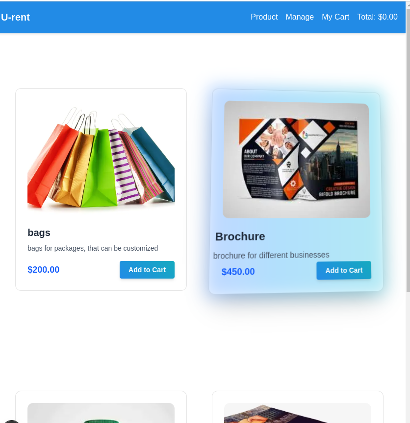
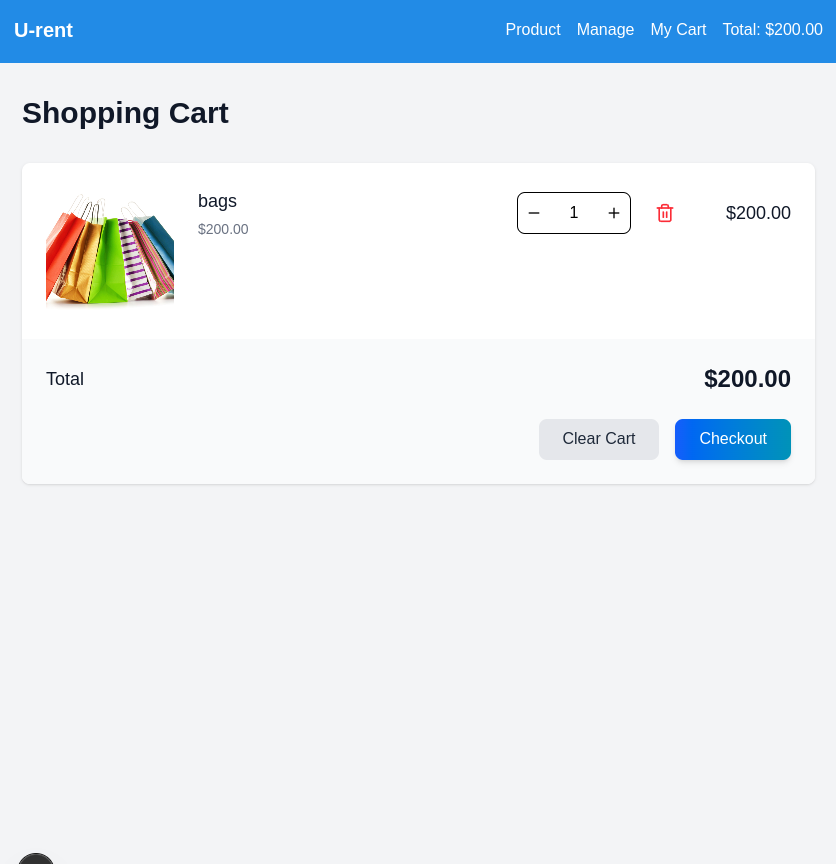
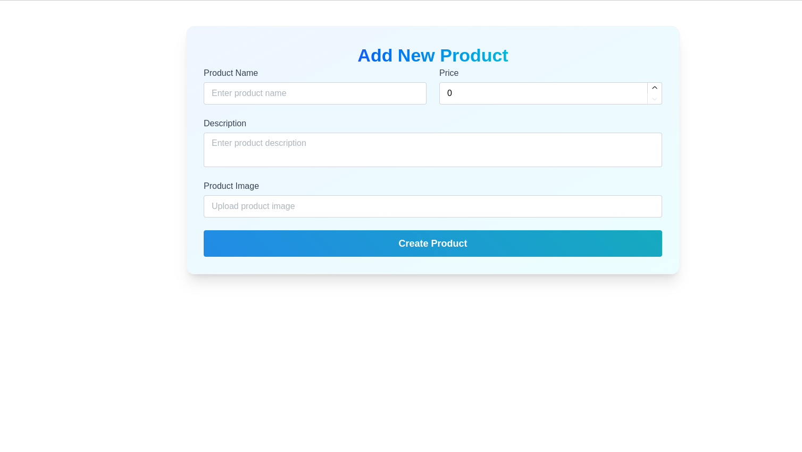

# Store
# Modern Store Platform

A flexible e-commerce/rental platform with 3D product displays and management features.

## 🖼️ Project Showcase

### Home Page

### Cart

### Mobile View

## Features

- ✨ Interactive 3D product cards
- 🛒 Real-time shopping cart
- 📦 Product management (add/edit/delete)
- 📁 Image uploads
- 📱 Responsive design

## Quick Start

1. **Clone the repo**
  
   git clone https://github.com/bisratlike/u-rent-Next.git
   cd u-rent-n

install dependencies

    npm install

Set up environment
Create .env file and fill the following by your credential

DATABASE_URL="your_postgres_connection"
CLOUD_NAME="your_cloudinary_name"
API_KEY="your_cloudinary_key"

Run the app

        npm run dev

Tech Used

    Next.js

    TypeScript

    Tailwind CSS

    PostgreSQL

    Drizzle ORM

    Cloudinary

Customize

    Rename the project in package.json and components

    Update colors in tailwind.config.js

    Modify 3D effects in /components/ui

    Add your logo and branding

Need Help?

Open an issue or email [bisratlike@email.com]